# Fiori Elements Navigation Patterns Showcase

A CAP Node.js + SAP Fiori Elements (OData V4) project that demonstrates outbound navigation patterns from a List Report.

## Table of Contents

- [Purpose](#purpose)
- [Getting Started](#getting-started)
- [App Structure](#app-structure)
- [Group A — Navigation Triggers](#group-a--navigation-triggers)
  - [Which pattern should I use?](#which-pattern-should-i-use)
  - [A-1: Semantic Link](#a-1-semantic-link)
  - [A-2〜A-4: IBN Button / Action](#a-2a-4-ibn-button--action-datafieldforintentbasednavigation)
  - [A-5: Direct IBN Link](#a-5-direct-ibn-link)
  - [A-6: URL Link](#a-6-url-link)
  - [A-7: Replace Row-Click Navigation](#a-7-replace-row-click-navigation)
  - [Supplementary: Dynamic Semantic Object](#dynamic-semantic-object-a-1-only)
  - [Supplementary: NavigationAvailable](#navigationavailable-conditional-button-visibility)
  - [Supplementary: Hiding Unwanted Actions](#hiding-unwanted-actions-from-a-semantic-object)
- [Navigation Target App](#navigation-target-app-nav-target)
- [Group B — Navigation Context Control](#group-b--navigation-context-control)
  - [B-1: Field Rename via Mapping](#b-1-field-rename-via-mapping)
  - [B-2: Association field without mapping](#b-2-association-field-without-mapping--not-passed)
  - [B-3: Association field passed via IBN Mapping](#b-3-association-field-passed-via-ibn-mapping)
  - [B-4: Handling Sensitive and Inapplicable Data](#b-4-handling-sensitive-and-inapplicable-data)
- [Project Structure](#project-structure)

## Purpose

This project serves as a hands-on reference for developers learning how to implement cross-application navigation in SAP Fiori Elements apps. It covers two groups of patterns:

- **Group A** — How to trigger navigation
- **Group B** — What context gets passed to the target app

> **Scope:** This project covers navigation patterns achievable through **OData annotations** only. Controller extensions are out of scope, though they may be explored separately in the future.

## Getting Started

```bash
npm install
cds watch
```

Open `http://localhost:4004/$launchpad` to access the FLP sandbox. Click the **Navigation Source** tile to open the List Report.

## App Structure

| App | Entity | Role |
|-----|--------|------|
| `app/nav-source` | Orders | Source app — demonstrates all navigation triggers |
| `app/nav-target` | NavTargets | Target app — shows received navigation context in filter bar |

---

## Group A — Navigation Triggers

### Which pattern should I use?

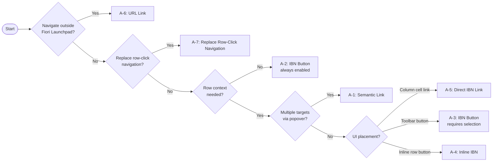

All patterns are visible in the **nav-source List Report**.

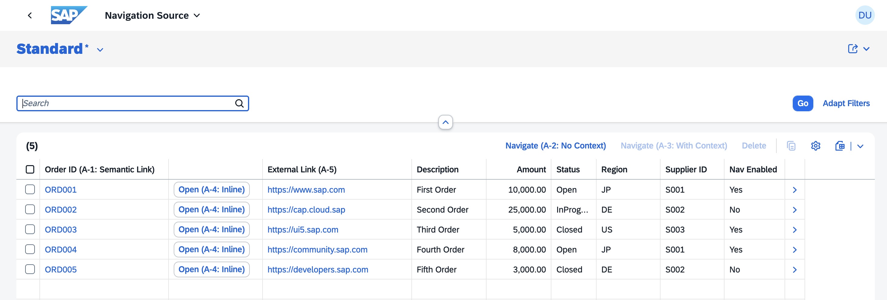

### A-1: Semantic Link

The `orderId` column renders as a clickable link. Clicking it opens a quick-actions popover listing all registered intents for the `NavTarget` semantic object. `app/nav-target/webapp/manifest.json` registers three inbound targets for the `NavTarget` semantic object (`display`, `manage`, `analyze`), but `analyze` is suppressed via [`SemanticObjectUnavailableActions`](#hiding-unwanted-actions-from-a-semantic-object) — so the popover shows two navigation options. This demonstrates both multi-target resolution and selective action hiding.

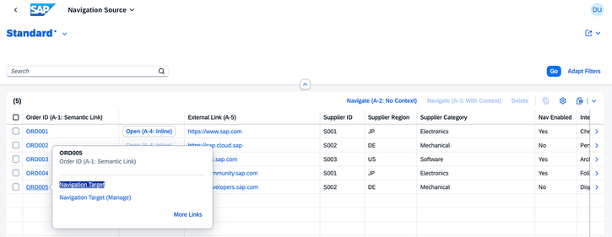

**Implementation** — `app/nav-source/annotations.cds`:
```cds
annotate service.Orders with {
    orderId @Common.SemanticObject: 'NavTarget';
};
```

**What to verify:** `orderId` cells appear as blue hyperlinks. Clicking one opens a popover with two options: "Navigation Target" (display) and "Navigation Target (Manage)" (manage). The "analyze" action is not shown.

---

### A-2〜A-4: IBN Button / Action (`DataFieldForIntentBasedNavigation`)

IBN (Intent-Based Navigation) is a decoupled navigation mechanism in SAP Fiori. Instead of hardcoding a target URL, the source app declares a semantic intent (`SemanticObject` + `Action`). The FLP resolves the intent at runtime and routes to the registered target app.

All three patterns use `UI.DataFieldForIntentBasedNavigation` and differ only in `RequiresContext` and `Inline`.

#### A-2: Always-Enabled Toolbar Button (`RequiresContext: false`)

A toolbar button that is always active, even without selecting a row. Navigates to `NavTarget-display` with no entity context.

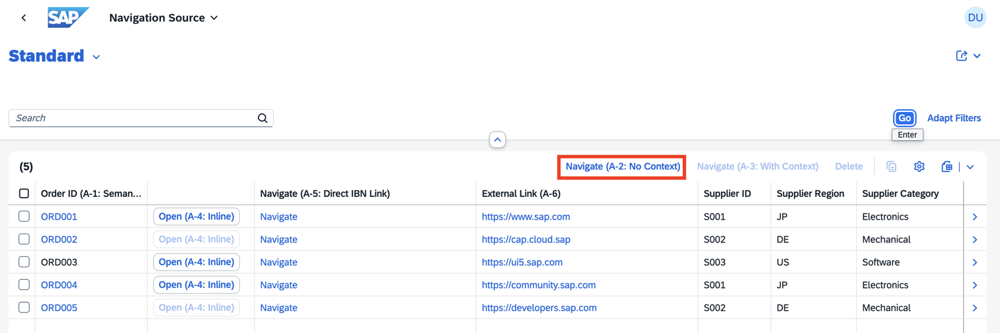

**Implementation** — `app/nav-source/annotations.cds`:
```cds
{
    $Type          : 'UI.DataFieldForIntentBasedNavigation',
    Label          : 'Navigate (A-2: No Context)',
    SemanticObject : 'NavTarget',
    Action         : 'display',
    RequiresContext: false,
}
```

**What to verify:** The button is enabled before any row is selected.

---

#### A-3: Context-Required Toolbar Button (`RequiresContext: true`)

A toolbar button that is disabled until one or more rows are selected. Passes the selected row's context to the target.

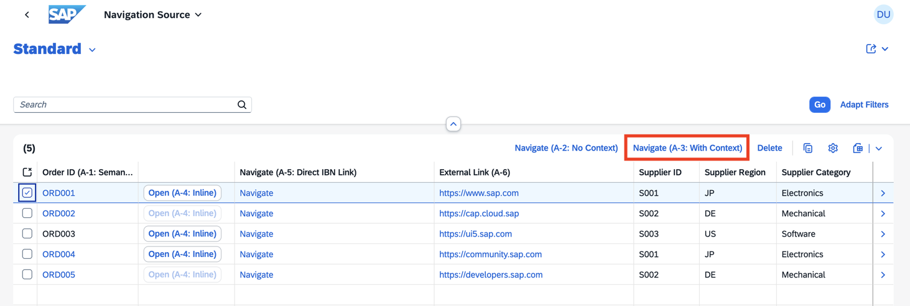

**Implementation** — `app/nav-source/annotations.cds`:
```cds
{
    $Type          : 'UI.DataFieldForIntentBasedNavigation',
    Label          : 'Navigate (A-3: With Context)',
    SemanticObject : 'NavTarget',
    Action         : 'display',
    RequiresContext: true,
}
```

**What to verify:** The button is greyed out initially; activates after selecting a row.

---

#### A-4: Inline Button (`Inline: true`)

A button rendered inside each row (not in the toolbar). Each button carries that row's context.

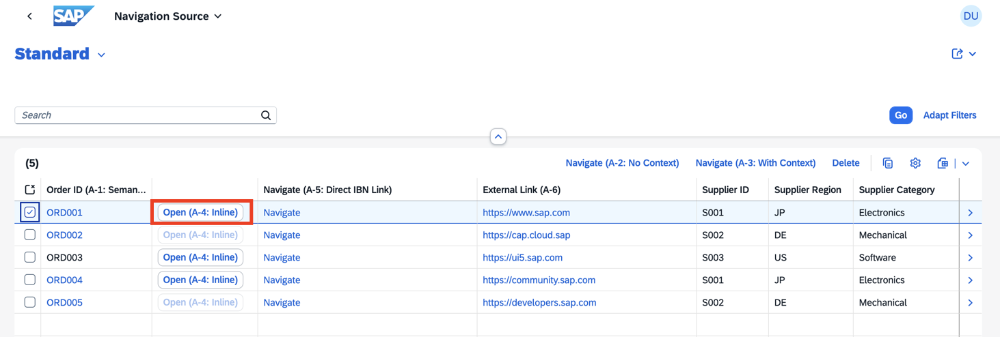

**Implementation** — `app/nav-source/annotations.cds`:
```cds
{
    $Type          : 'UI.DataFieldForIntentBasedNavigation',
    Label          : 'Open (A-4: Inline)',
    SemanticObject : 'NavTarget',
    Action         : 'display',
    RequiresContext: true,
    Inline         : true,
}
```

**What to verify:** A button appears inside each row.

> **Constraint:** Inline IBN buttons have no column header regardless of table type (GridTable or ResponsiveTable). This is by design in Fiori Elements — `Label` controls the button text only, not the column header.

---

### A-5: Direct IBN Link

A table column where each cell is rendered as a hyperlink that navigates **directly** to a specific `SemanticObject + Action` — no popover.

This contrasts with A-1 (`@Common.SemanticObject`), which triggers FLP intent resolution and shows a popover listing all registered inbound targets. `DataFieldWithIntentBasedNavigation` skips the popover and navigates immediately to the declared target.

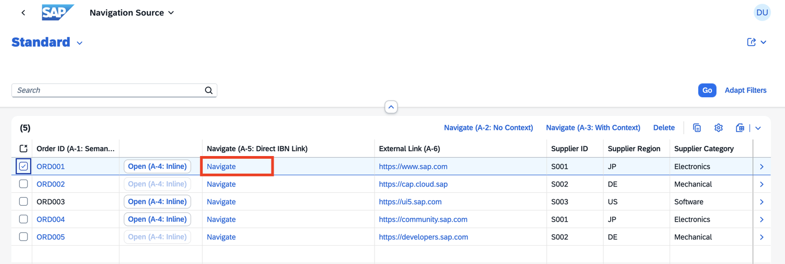

**Implementation** — `app/nav-source/annotations.cds`:
```cds
{
    $Type         : 'UI.DataFieldWithIntentBasedNavigation',
    Label         : 'Navigate (A-5: Direct IBN Link)',
    Value         : 'Navigate',
    SemanticObject: 'NavTarget',
    Action        : 'display',
    Mapping       : [
        { LocalProperty: supplierId,         SemanticObjectProperty: 'vendor'           },
        { LocalProperty: _Supplier.category, SemanticObjectProperty: 'supplierCategory' },
    ],
},
```

**What to verify:** A "Navigate (A-5: Direct IBN Link)" column appears with each cell showing "Navigate" as a blue hyperlink. Clicking it navigates directly to the Navigation Target app — no popover appears. Compare with A-1: clicking `orderId` shows a popover with two options first.

---

### A-6: URL Link

A table column whose cell value is rendered as a hyperlink to an external URL. Opens in a new browser tab.

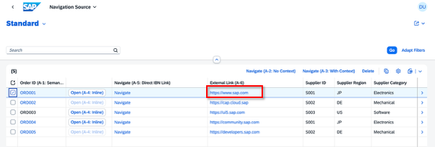

**Implementation** — `app/nav-source/annotations.cds`:
```cds
{
    $Type              : 'UI.DataFieldWithUrl',
    Label              : 'External Link (A-6)',
    Value              : externalUrl,
    Url                : externalUrl,
    ![@HTML5.LinkTarget]: '_blank',
}
```

**What to verify:** The `External Link (A-6)` column shows clickable URLs that open in a new tab.

---

### A-7: Replace Row-Click Navigation

By default, clicking a row navigates to the Object Page. This pattern replaces that behavior so the row click (chevron) navigates to an external app instead.

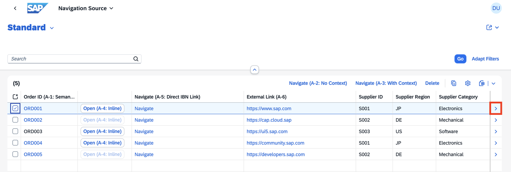

**Implementation** — `app/nav-source/webapp/manifest.json`:
```json
"sap.app": {
  "crossNavigation": {
    "outbounds": {
      "NavTargetDisplay": {
        "semanticObject": "NavTarget",
        "action": "display"
      }
    }
  }
},
"sap.ui5": {
  "routing": {
    "targets": {
      "OrdersList": {
        "options": {
          "settings": {
            "navigation": {
              "Orders": {
                "detail": {
                  "outbound": "NavTargetDisplay"
                }
              }
            }
          }
        }
      }
    }
  }
}
```

**What to verify:** Clicking a row (or the chevron) navigates to the Navigation Target app instead of an Object Page.

> **Constraint:** Once `detail.outbound` is set, the Object Page is no longer reachable via row click. The route still exists in the manifest but is bypassed.

---

## Group A — Supplementary Patterns

### Dynamic Semantic Object (A-1 only)

`Common.SemanticObject` accepts a property path reference, allowing the semantic object to be resolved per row at runtime. Rows where the resolved semantic object has no registered FLP inbounds are rendered as plain text — no link is shown.

**Implementation** — `app/nav-source/annotations.cds`:
```cds
annotate service.Orders with {
    orderId @Common.SemanticObject: semanticObject;  // property reference, no quotes
};
```

```cds
// db/schema.cds
entity Orders {
    ...
    semanticObject : String(50);  // e.g. 'NavTarget', 'Customer', ''
}
```

**What to verify:** Rows with `semanticObject = 'NavTarget'` show `orderId` as a blue hyperlink. A row with an unregistered value (e.g. `'Customer'`) shows `orderId` as plain text.

> **A-1 only — IBN buttons do not support dynamic binding.**
> Setting `SemanticObject` or `Action` to a property path in `DataFieldForIntentBasedNavigation` (A-3/A-4) is not supported by Fiori Elements:
> - Both as path → List Report fails to render entirely
> - `SemanticObject` as path only → app renders but navigation fails with "Navigation to this application is not supported"
>
> The dynamic path feature of `Common.SemanticObject` is specific to the semantic link mechanism, where the FLP resolves intents at click time. IBN buttons declare a static intent at annotation time and cannot resolve it dynamically.

---

### NavigationAvailable (Conditional Button Visibility)

`NavigationAvailable` controls whether an IBN button is shown for a given row. When the bound field is `false`, the button is hidden for that row.

In this project, `ORD002` and `ORD005` have `isNavEnabled = false` — their inline button (A-4) and context-aware toolbar button (A-3) are hidden.


**Implementation** — `app/nav-source/annotations.cds`:
```cds
// A-4 Inline
{
    $Type               : 'UI.DataFieldForIntentBasedNavigation',
    ...
    NavigationAvailable : isNavEnabled,
}

// A-3 Toolbar (requires selection)
{
    $Type               : 'UI.DataFieldForIntentBasedNavigation',
    ...
    NavigationAvailable : isNavEnabled,
}
```

**What to verify:** Rows for ORD002 and ORD005 show no inline navigation button. Selecting those rows keeps the A-3 toolbar button disabled.

> **Note:** `NavigationAvailable` does not apply to A-2 (`RequiresContext: false`) because that button carries no row context.

---

### Hiding Unwanted Actions from a Semantic Object

`SemanticObjectUnavailableActions` hides specific actions from the popover shown when a semantic link is clicked (A-1). The actions are still registered as inbound targets in the FLP — they are just suppressed from appearing as navigation options.

In this project, three inbounds are registered for `NavTarget`: `display`, `manage`, and `analyze`. Without the annotation, all three appear in the A-1 popover. Adding `SemanticObjectUnavailableActions: ['analyze']` keeps `display` and `manage` visible while hiding `analyze`.

**Implementation** — `app/nav-source/annotations.cds`:
```cds
annotate service.Orders with {
    orderId @Common.SemanticObjectUnavailableActions: ['analyze'];
};
```

**Inbound registration** — `app/nav-target/webapp/manifest.json`:
```json
"NavTarget-analyze": {
  "semanticObject": "NavTarget",
  "action": "analyze",
  "title": "Navigation Target (Analyze)",
  ...
}
```

**What to verify:** Click the `orderId` semantic link. The popover shows two options — "Navigation Target" (display) and "Navigation Target (Manage)" (manage). The "analyze" action does not appear, even though it is registered as an inbound.

---

## Navigation Target App (nav-target)

The target app receives inbound navigation context and pre-populates the filter bar fields automatically when parameter names match `SelectionFields`.

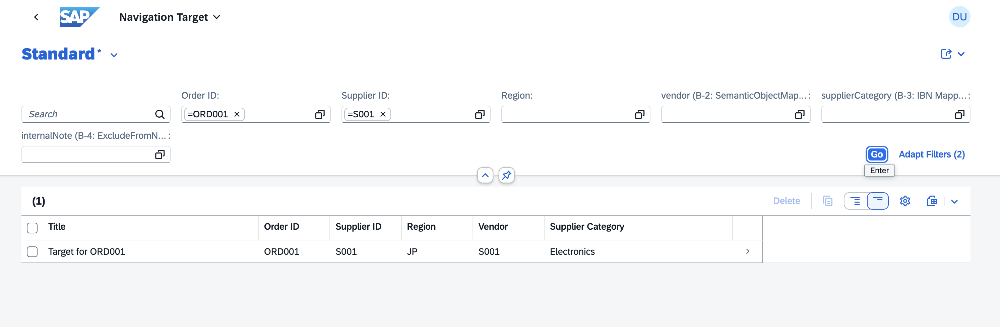

**Inbound registration** — `app/nav-target/webapp/manifest.json`:
```json
"crossNavigation": {
  "inbounds": {
    "NavTarget-display": {
      "semanticObject": "NavTarget",
      "action": "display",
      "signature": {
        "parameters": {
          "orderId": { "required": false },
          "supplierId": { "required": false }
        },
        "additionalParameters": "allowed"
      }
    }
  }
}
```

**SelectionFields** — `app/nav-target/annotations.cds`:
```cds
UI.SelectionFields: [ orderId, supplierId, region, vendor, supplierCategory ]
```

**What to verify:** After navigating from nav-source, the filter bar in nav-target is pre-filled with the context values from the selected row.

---

---

## Group B — Navigation Context Control

This section covers **what data is passed** to the target app during navigation.

### B-1: Field Rename via Mapping

Two mechanisms rename a local field when it is passed as a navigation parameter. Both send `supplierId` as `vendor` to the target.

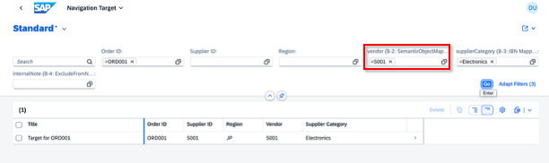

---

#### A-1: `Common.SemanticObjectMapping`

**Key rule:** `@Common.SemanticObjectMapping` must be placed on the **same property** as `@Common.SemanticObject`. The FLP resolves the mapping only when following a semantic link tied to that semantic object.

**Implementation** — `app/nav-source/annotations.cds`:
```cds
annotate service.Orders with {
    orderId @Common.SemanticObject: 'NavTarget'
            @Common.SemanticObjectMapping: [
                { LocalProperty: supplierId, SemanticObjectProperty: 'vendor' },
            ];
};
```

**What to verify (A-1 only):** Click the `orderId` semantic link. In nav-target, the `vendor` filter field is pre-filled with the order's `supplierId` value. The `supplierId` filter field is NOT pre-filled (parameter name was renamed).

> **One field, one target name:** A mapped field is sent *only* under the mapped name (`vendor`). It is **not** sent under its original name (`supplierId`) at the same time. If you need the value available under both names, you would need two separate fields — this is a structural constraint of `SemanticObjectMapping`.

---

#### A-3〜A-5: `Mapping` property (all IBN patterns)

Both `DataFieldForIntentBasedNavigation` (A-2〜A-4) and `DataFieldWithIntentBasedNavigation` (A-5) support a `Mapping` property that renames a local field when passed as a navigation parameter. This supports the same direct field renaming as `Common.SemanticObjectMapping`, and additionally supports navigation property paths (see B-3).

**Implementation** — `app/nav-source/annotations.cds`:
```cds
{
    $Type          : 'UI.DataFieldForIntentBasedNavigation',
    SemanticObject : 'NavTarget',
    Action         : 'display',
    RequiresContext: true,
    Mapping        : [
        { LocalProperty: supplierId, SemanticObjectProperty: 'vendor' },
    ],
},
```

**What to verify (A-3):** Select a row and click "Navigate (A-3: With Context)". In nav-target, the `vendor` filter field is pre-filled with the order's `supplierId` value.

---

### B-2: Association field without mapping — not passed

`Orders` has no direct `region` field. `Suppliers` has `region`, but it is only accessible via the `_Supplier` navigation property. Without a `SemanticObjectMapping` on `_Supplier`, `_Supplier/region` is excluded from the navigation context.

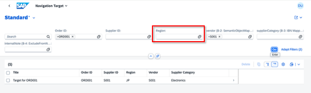

**Implementation:** No code change needed — the absence of mapping is the pattern itself.

**What to verify (A-1):** Click the `orderId` semantic link. In nav-target, the `region` filter field is **empty** — confirming that `_Supplier/region` is not passed by default.

---

### B-3: Association field passed via IBN Mapping

`Common.SemanticObjectMapping` (used by the A-1 semantic link) **cannot** reference navigation property paths as `LocalProperty` — the SAP Fiori Elements docs explicitly state: _"Navigation properties cannot be used within the annotation as mapping properties."_

Instead, the `Mapping` property on IBN patterns **does** support navigation property paths. This applies to all IBN patterns: `DataFieldForIntentBasedNavigation` (A-3, A-4) and `DataFieldWithIntentBasedNavigation` (A-5).

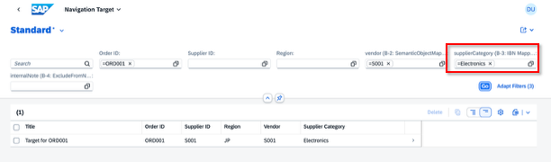

**Implementation** — `app/nav-source/annotations.cds`:
```cds
{
    $Type          : 'UI.DataFieldForIntentBasedNavigation',
    SemanticObject : 'NavTarget',
    Action         : 'display',
    RequiresContext: true,
    Mapping        : [
        { LocalProperty: _Supplier.category, SemanticObjectProperty: 'supplierCategory' },
    ],
},
```

**What to verify (A-3/A-4/A-5):** Select a row and click "Navigate (A-3)" or "Open (A-4: Inline)", or click the "Navigate (A-5: Direct IBN Link)" cell link. In nav-target, the `supplierCategory` filter field is pre-filled with the supplier's `category` value. The `region` filter remains empty (no mapping — B-2 contrast). Note: clicking the A-1 semantic link does **not** pass `supplierCategory` (framework limitation).

---

### B-4: Handling Sensitive and Inapplicable Data

During outbound navigation, SAP Fiori Elements automatically removes certain properties from the navigation context. These are not passed to the target app regardless of what the navigation trigger is.

Three annotation types cause a property to be excluded:

| Annotation | Description |
|---|---|
| `PersonalData.IsPotentiallySensitive` | Personally identifiable or sensitive data (e.g. credit card numbers) |
| `UI.ExcludeFromNavigationContext` | Explicitly opt out any field from the navigation context |
| `Common.FieldControl` → `Inapplicable` | Fields that are not applicable for the selected row at runtime |

Measures in analytical services (`Analytics.v1.CustomAggregate`) are also excluded automatically.

These annotations apply to **all external outbound navigation patterns** — A-1, A-3, A-4, A-5, and A-7 alike. A-2 carries no row context to begin with, and A-6 uses a direct URL rather than the IBN context mechanism, so those two are not affected.

In this project, `internalNote` is annotated with `UI.ExcludeFromNavigationContext`. The field is visible in the nav-source table and also appears as a filter bar field in nav-target — but it is never included in the navigation parameters regardless of which trigger is used.

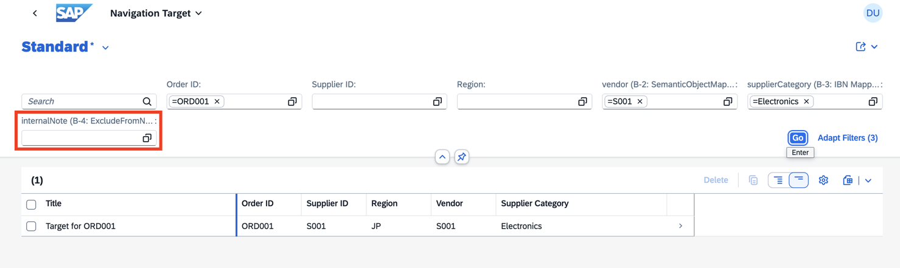

**Implementation** — `app/nav-source/annotations.cds`:
```cds
annotate service.Orders with {
    internalNote @UI.ExcludeFromNavigationContext;
};
```

**What to verify:** Select any row in nav-source (e.g. ORD001, which has `internalNote = "Check payment terms before shipping"`) and navigate using A-1, A-3, A-4, A-5, or A-7 (row click). In nav-target, the `orderId` filter field is pre-filled — but the `internalNote (B-4: ExcludeFromNavigationContext)` filter field is empty for all navigation triggers, confirming the exclusion is pattern-independent.

> **Caution:** Sensitive properties of navigation entities beyond one level are **not** automatically removed from the navigation context.

---

## Project Structure

```
db/
  schema.cds              — Orders, Suppliers, NavTargets entities
  data/                   — CSV sample data (5 orders, 3 suppliers, 5 targets)

srv/
  service.cds             — NavigationSourceService, NavigationTargetService

app/nav-source/
  annotations.cds         — A-1 through A-6 annotations, B-1/B-3/B-4 context annotations, SemanticObjectUnavailableActions
  webapp/manifest.json    — A-7, crossNavigation.outbounds, FLP inbound

app/nav-target/
  annotations.cds         — SelectionFields for filter bar population
  webapp/manifest.json    — crossNavigation.inbounds (NavTarget-display, NavTarget-manage, NavTarget-analyze)

test/
  nav-service.test.js     — OData protocol-level tests
```
